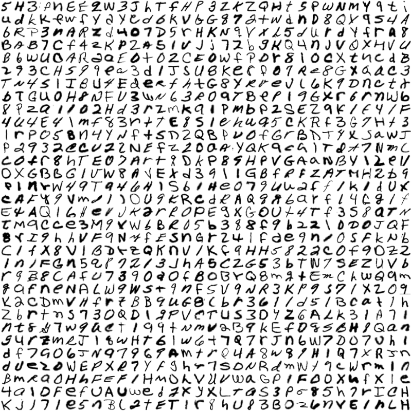
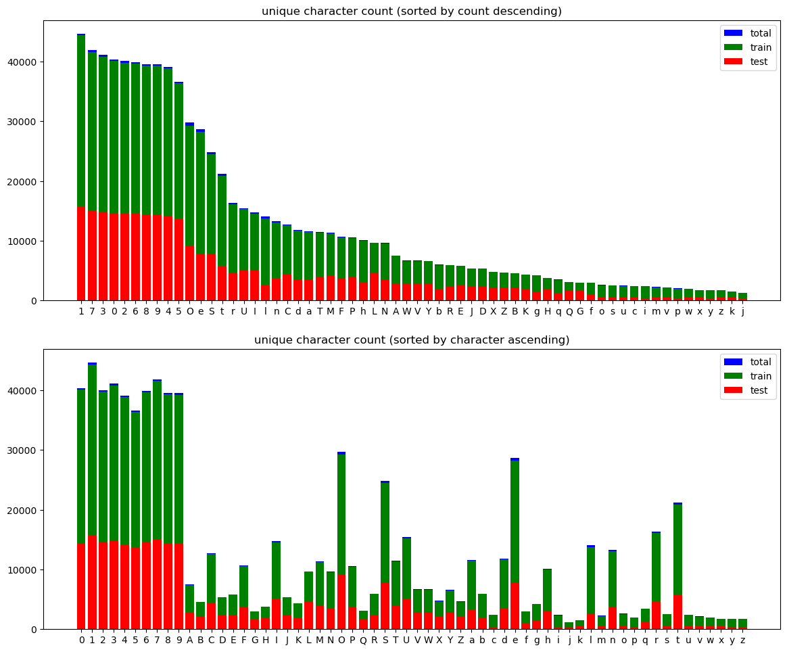
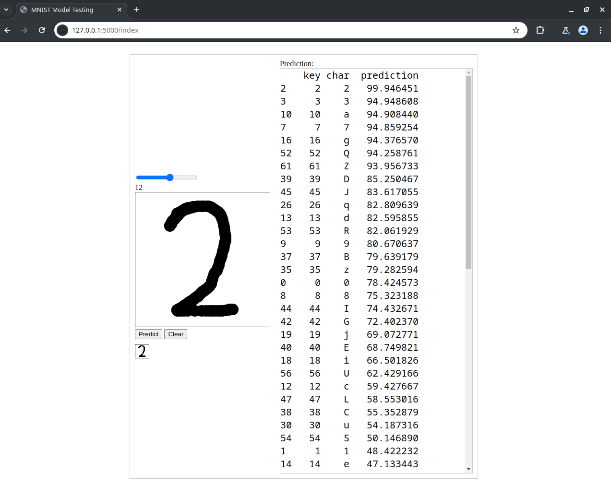
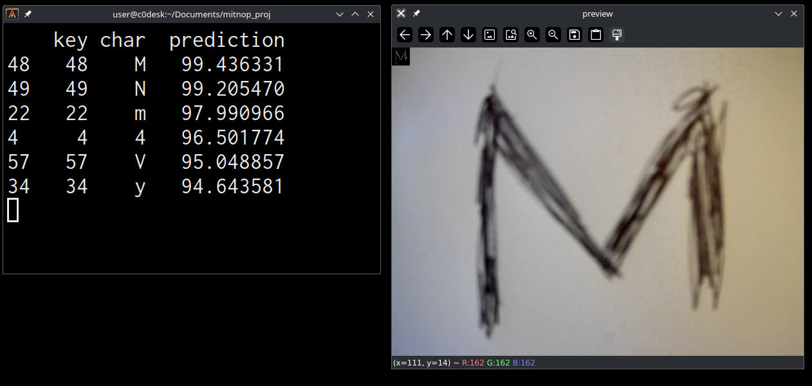
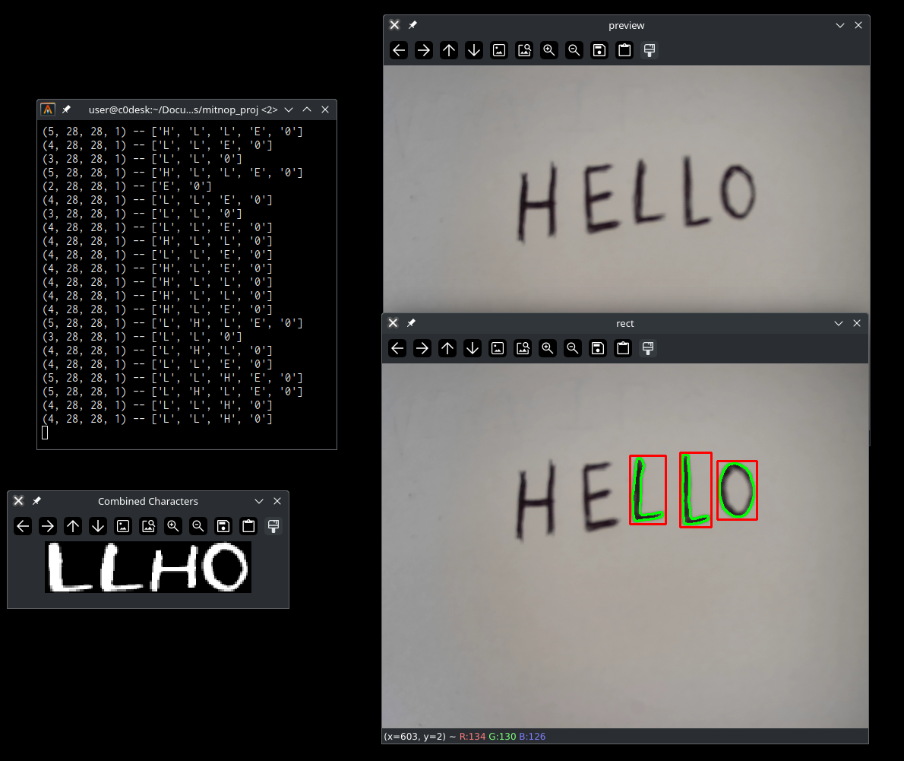

# Detecting hand written digits and letters from images.

[](http://www.python.org/download/)

## Requirements
* python
* python-virtualenv
* curl

## Requirements - pip
* pandas
* numpy
* matplotlib
* flask
* flask_cors
* opencv-python
* ipykernel
* tensorflow
* torch

## Download the EMNIST dataset

```sh
./dldataset.sh
```
after the command finishes you should have the gzip.zip file in the datasets folder
<br>
the script will also extract the zip file
<br>
if the script fails consider downloading the dataset manually:
- https://www.nist.gov/itl/products-and-services/emnist-dataset
- https://biometrics.nist.gov/cs_links/EMNIST/Readme.txt
- https://biometrics.nist.gov/cs_links/EMNIST/gzip.zip



## Analyse the downloaded set
```sh
cd py_stats
./analysis.py       # graph char counts
./checkdupes.py     # check for duplicates
./grid.py           # draw grids for first couple of images
```



## TensorFlow
before running anything, setup the virtual environment with:
```sh
cd py_tensorflow
./setup-env.sh
source p3env/bin/activate
```

### Training the convolutional neural network
run the following command if you want to train the network on the entire EMNIST set (train+test)
```sh
./train.py
```

run the following commands if you want to train the network on 80% of the set
and test on the remaining 20%
```sh
./proper_train_test_split.py
./train_80p.py
./test_20p.py
```

### Testing the convolutional neural network - drawing input

Test the trained network with
```
./test_draw.py
```
this will run a flask server web page on 
http://localhost:5000/index
that will allow you to draw characters and test the accuracy of the convolutional neural network



### Testing the convolutional neural network - camera input

single character detection
```
./test_camera.py
```


multiple character detection, newer version (needs some work)
```
./test_camera2.py
```


# PyTorch
```sh
cd py_torch
./setup-env.sh
source p3env/bin/activate
```
#### TODO: remake this proj in pytorch
